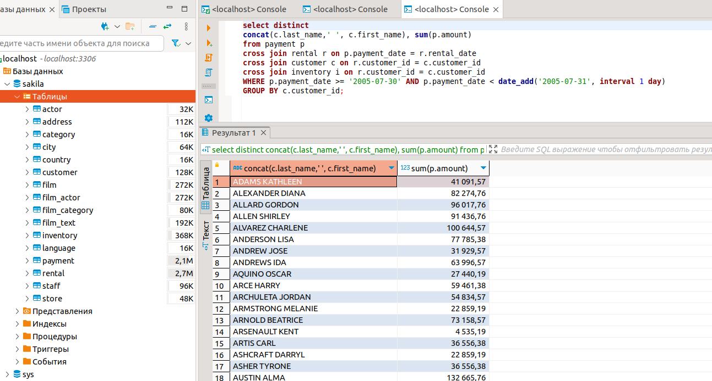

# Домашнее задание к занятию "Индексы" - `Нагорнов Антон Алексеевич`

### Задание 1

SELECT (SUM(INDEX_LENGTH) / SUM(DATA_LENGTH)) * 100 AS table_index  
from information_schema.TABLES  
WHERE TABLE_SCHEMA = 'sakila';  

### Задание 2

После анализа запроса было выявлено, что много времени тратиться на обработку лишних таблиц (inventory, rental, film). Данные из этих таблиц для выполнения запроса вообще не нужны, т.к. подсчитывается платежи за конкретную дату. Поэтому из запроса их можно просто удалить и мы получаем абсолютно те же данные, что и в исходном запросе, только быстрее в 5 раз минимум. На обработку исходного запроса ушло порядка 6 секунд, оптимизированный запрос выполнился моментально.

select distinct concat(c.last_name, ' ', c.first_name), sum(p.amount) over (partition by c.customer_id)  
from payment p, customer c  
where date(p.payment_date) = '2005-07-30' and p.customer_id = c.customer_id;  

После доработки:  
select distinct  
concat(c.last_name,' ', c.first_name), sum(p.amount)  
from payment p  
cross join rental r on p.payment_date = r.rental_date  
cross join customer c on r.customer_id = c.customer_id  
cross join inventory i on r.customer_id = c.customer_id  
WHERE p.payment_date >= '2005-07-30' AND p.payment_date < date_add('2005-07-31', interval 1 day)  
GROUP BY c.customer_id;  

